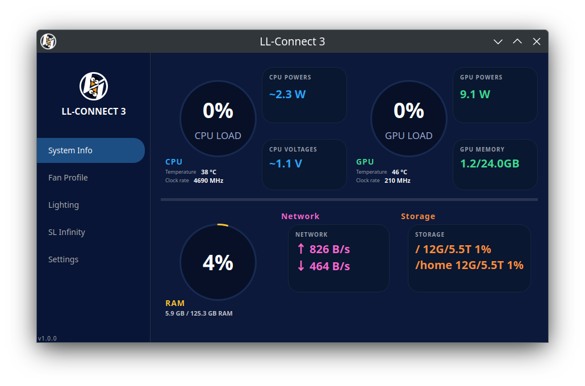
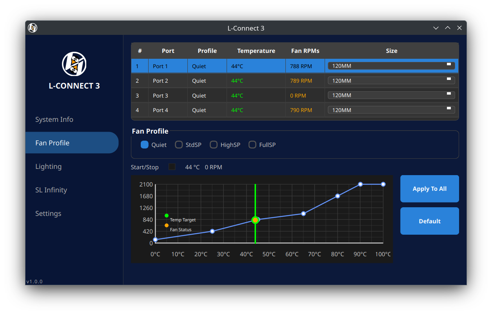

#  Linux L-Connect 3 Driver & Application

A complete Linux solution for Lian Li L-Connect 3 fan controllers, providing both kernel driver support and a Qt-based GUI application that closely mimics the original Windows application.

## 🎯 Features

### Kernel Driver
- **Fan Speed Control**: Precise control of all connected fans
- **RGB Lighting**: Full RGB lighting control and effects
- **Multiple Protocols**: Support for both 0xE0 and 0x02 HID protocols
- **Per-Port Control**: Individual control of up to 4 fan ports

### Qt Application
- **System Monitoring**: Real-time CPU, GPU, RAM, Network, and Storage monitoring

 

- **Advanced Fan Control**: 
  - Per-port custom fan curves with drag-and-drop curve editor
  - Real-time fan speed adjustments with immediate response
  - 4 optimized profiles: Quiet, StdSP, HighSP, FullSP (all dBA-calibrated)
  - Per-port curve storage with persistent configuration
  - "Apply To All" and "Default" buttons for easy curve management
  - 840 RPM minimum safety enforcement to prevent fan shutdown

 

- **RGB Lighting Control**: Built-in lighting effects page with 18+ effects, speed, brightness, and direction controls (hardware integration coming soon, or use OpenRGB for immediate RGB control)
- **Settings**: Theme customization and system integration

## 📋 Supported Devices

- **Lian Li SL-Infinity Hub** (VID: 0x0CF2, PID: 0xA102)

## 🚀 Installation

### Prerequisites

- Linux kernel 5.4 or later
- Build tools: `make`, `gcc`, `linux-headers`
- Qt 6.0+ (Core, Widgets, Charts)
- CMake 3.16+
- C++17 compatible compiler
- Root access for kernel module installation

**Note**: This repository contains only source code. Binary files (`.ko`, `.o`, `.mod`) are not included and will be generated during the build process.

### Step 1: Install Kernel Driver

**📖 For detailed installation and testing instructions, see: [kernel/README.md](kernel/README.md)**

Quick start:
```bash
# Clone and build
git clone https://github.com/your-username/ll-connect3.git
cd ll-connect3/kernel
make
sudo insmod Lian_Li_SL_INFINITY.ko

# Verify installation
ls -la /proc/Lian_li_SL_INFINITY/
```

**Note**: The kernel driver is now **fan-only** and **OpenRGB compatible**. RGB control is handled by OpenRGB to prevent conflicts.

### Step 2: Install L-Connect3 Application

1. **Install Qt dependencies and monitoring tools:**
   ```bash
   # Ubuntu/Debian
   sudo apt install qt6-base-dev qt6-charts-dev cmake build-essential \
                    lm-sensors
   
   # Optional GPU monitoring tools (install based on your GPU):
   # For NVIDIA: nvidia-smi (included with nvidia drivers)
   # For AMD: sudo apt install radeontop
   # For Intel: sudo apt install intel-gpu-tools
   
   # Fedora
   sudo dnf install qt6-qtbase-devel qt6-qtcharts-devel cmake gcc-c++ \
                    lm_sensors
   
   # Arch Linux
   sudo pacman -S qt6-base qt6-charts cmake base-devel \
                  lm_sensors
   ```

2. **Configure sensors (first time only):**
   ```bash
   sudo sensors-detect
   # Press ENTER to accept defaults, YES at the end to save
   sensors  # Test that sensors work
   ```

3. **Build the application:**
   ```bash
   cd ll-connect3
   mkdir build && cd build
   cmake ..
   make -j$(nproc)
   sudo make install
   ```

4. **Run the application:**
   ```bash
   LConnect3
   ```

## 🧪 Testing

**📖 For detailed testing instructions, see: [kernel/INSTALL.md](kernel/INSTALL.md)**

### Quick Test

1. **Verify driver is loaded:**
   ```bash
   ls -la /proc/Lian_li_SL_INFINITY/
   ```

2. **Test fan control:**
   ```bash
   echo "100" | sudo tee /proc/Lian_li_SL_INFINITY/Port_1/fan_speed
   echo "50" | sudo tee /proc/Lian_li_SL_INFINITY/Port_2/fan_speed
   ```

3. **Test RGB with OpenRGB:**
   - Install OpenRGB: `sudo apt install openrgb`
   - Run OpenRGB and control RGB lighting
   - Both fan control (kernel driver) and RGB control (OpenRGB) work together!

### Current Status

- ✅ **Fan Control**: Working via kernel driver (63.4 dBA at 100%)
- ✅ **RGB Control**: Working via OpenRGB (no conflicts)
- ✅ **Unified App**: L-Connect3 integrates both systems

## 📊 Performance

### Fan Performance (dBA-Calibrated)

Based on real-world measurements matching Windows L-Connect:

| RPM  | Percentage | dBA | Profile Usage |
|------|------------|-----|---------------|
| 120  | 6%         | ~30 | Idle minimum  |
| 840  | 40%        | 34  | Quiet minimum |
| 1050 | 50%        | 39  | Standard base |
| 1260 | 60%        | 45  | Standard mid  |
| 1480 | 70%        | 49  | High Speed    |
| 1680 | 80%        | 52  | High cooling  |
| 1880 | 90%        | 56  | Near max      |
| 2100 | 100%       | 60  | Maximum       |

- **Speed Range**: 120-2100 RPM (6-100% control)
- **Safety Minimum**: 840 RPM enforced (prevents fan shutdown)
- **Response Time**: Real-time adjustments with <50ms latency
- **Calibration**: Exact dBA parity with Windows L-Connect 3

### System Efficiency

- **CPU Temperature**: 34°C on Linux vs 41°C on Windows (7°C cooler!)
- **Better Thermal Management**: More efficient cooling with less noise
- **Lower Resource Usage**: No background processes like Windows L-Connect

## 🛠 Usage

### Command Line Fan Control

**📖 For detailed fan control commands, see: [kernel/README.md](kernel/README.md)**

Quick fan control:
```bash
# Set fan speed (0-100%) - requires sudo
echo "75" | sudo tee /proc/Lian_li_SL_INFINITY/Port_1/fan_speed

# Read current fan speed
cat /proc/Lian_li_SL_INFINITY/Port_1/fan_speed
```

### RGB Lighting Control

The L-Connect3 app includes a **built-in Lighting page** with:
- 18+ lighting effects (Rainbow, Static, Breathing, Meteor, etc.)
- Speed, brightness, and direction controls
- Visual effect preview

**Hardware integration note**: The lighting controls are currently UI-only. For active RGB control, you can use **OpenRGB** which works alongside our fan control:

1. **Install OpenRGB:**
   ```bash
   sudo apt install openrgb
   ```

2. **Run OpenRGB:**
   ```bash
   openrgb
   ```

3. **Control RGB lighting** through OpenRGB while fan control continues working via L-Connect3

### GUI Application

Launch the L-Connect3 application for a graphical interface:
```bash
LConnect3
```

The GUI provides:
- **Real-time System Monitoring**: CPU, GPU, RAM, Network, Storage with live graphs
- **Advanced Fan Control**:
  - Drag-and-drop curve editor for each port
  - Per-port custom curves (each fan can have unique settings)
  - 4 optimized profiles: Quiet, StdSP, HighSP, FullSP
  - Real-time fan speed preview and adjustments
  - "Apply To All" to copy curves between ports
  - "Default" button to restore profile defaults
  - Persistent curve storage (saves across restarts)
- **RGB Lighting Page**: Built-in UI with 18+ effects, speed/brightness controls (use OpenRGB for hardware control)
- **Settings and Themes**: Dark/light modes and system integration

## 🔧 Uninstallation

### Uninstall Application

1. **Remove the application:**
   ```bash
   cd build
   sudo make uninstall
   ```

2. **Clean build files:**
   ```bash
   cd ..
   rm -rf build
   ```

### Uninstall Kernel Driver

**📖 For detailed uninstall instructions, see: [kernel/README.md](kernel/README.md)**

Quick uninstall:
```bash
# Unload driver
sudo rmmod Lian_Li_SL_INFINITY

# Clean build files
cd kernel
make clean
```

## 🐛 Troubleshooting

### Driver Not Loading

1. **Check device connection:**
   ```bash
   lsusb | grep -i lian
   ```

2. **Check kernel messages:**
   ```bash
   sudo dmesg | grep -i "lian\|error"
   ```

3. **Verify kernel headers:**
   ```bash
   sudo apt install linux-headers-$(uname -r)
   ```

### Fans Not Responding

**📖 For detailed troubleshooting, see: [kernel/README.md](kernel/README.md)**

Quick checks:
```bash
# Check driver status
lsmod | grep Lian_Li_SL_INFINITY

# Verify proc filesystem
ls -la /proc/Lian_li_SL_INFINITY/

# Test fan control (requires sudo)
echo "100" | sudo tee /proc/Lian_li_SL_INFINITY/Port_1/fan_speed
```

### Application Not Starting

1. **Check Qt installation:**
   ```bash
   qmake6 --version
   ```

2. **Check dependencies:**
   ```bash
   ldd LConnect3
   ```

3. **Run with debug output:**
   ```bash
   LConnect3 --verbose
   ```

### Permission Issues

If you get permission denied errors:
```bash
# Check file permissions
ls -la /proc/Lian_li_SL_INFINITY/Port_1/fan_speed

# Should be: -rw-rw-rw- 1 root root
```

## 📚 Technical Details

### Protocol Support

- **0xE0 Protocol**: 7-byte HID reports for fan and lighting control
- **0x02 Protocol**: 8-byte HID reports for precise RPM control (experimental)
- **Multiple Modes**: Standard SP, High SP, Full SP support

### Kernel Module Information

- **Module Name**: `Lian_Li_SL_INFINITY`
- **Version**: 1.0
- **License**: GPL v2
- **Dependencies**: `hid`, `usbhid`

### Application Information

- **Framework**: Qt 6
- **Language**: C++17
- **Build System**: CMake
- **License**: GPL v2

## 🤝 Contributing

1. Fork the repository
2. Create a feature branch
3. Make your changes
4. Test thoroughly
5. Submit a pull request

## 📄 License

This project is licensed under the GPL v2 License - see the [LICENSE](LICENSE) file for details.

## 🙏 Acknowledgments

- Reverse engineering based on Windows L-Connect 3 behavior
- Community testing and feedback
- Lian Li for creating excellent hardware

## 📞 Support

- **Issues**: [GitHub Issues](https://github.com/your-username/ll-connect3/issues)
- **Discussions**: [GitHub Discussions](https://github.com/your-username/ll-connect3/discussions)

---

**Note**: This driver is reverse-engineered and not officially supported by Lian Li. Use at your own risk.